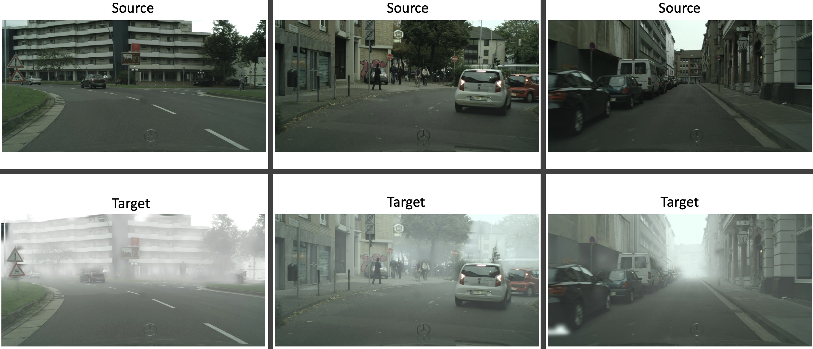

# Cityscapes-FoggyCityscapes Dataset
Edited version of Cityscapes to Foggy Cityscapes dataset for Unsupervised Domain Adaptation for Object Detection.

## Dataset Structure
The dataset contains 6950 annotations and images (3475 for the source and 3475 for the target) splitted as follow:
<ul>
  <li>Annotations: contains the source annotations (cityscapes) and target annotations (foggy cityscapes foggy level 0.02)</li>
  <ul>
    <li>Source Annotations (cityscapes): 2975 for the training set, 500 for the test set</li>
    <li>Target Annotations (foggy cityscapes): 2975 for the training set, 500 for the test set</li>
  </ul>
  <li>ImageSets: contains the subdivision of the sets</li>
  <ul>
    <li>Main</li>
        <ul>
          <li>Source training set: train_s.txt</li>
          <li>Source test set: test_s.txt</li>
          <li>Target training set: train_t.txt</li>
          <li>Target test set: test_t.txt</li>
        </ul>
  </ul>
  <li>JPEGImages: contains the source and target images</li>
    <ul>
      <li>Source images: source_*.jpg</li>
      <li>Target images: target_*.jpg</li>
    </ul>
</ul>  

## [Download](https://iplab.dmi.unict.it/EGO-CH-OBJ-UDA/Cityscapes-FoggyCityscapes.zip)

## Contributor and Citation
If you use this dataset for your experiments, please cite the authors Cityscapes [paper](https://www.cityscapes-dataset.com/citation/) 
Official Cityscapes Dataset [page](https://www.cityscapes-dataset.com/)

If you use this dataset for your experiments leave a star ⭐ 

# Other Works
Related Domain Adaptation Object Detectors: 
[DA-RetinaNet](https://github.com/fpv-iplab/DA-RetinaNet) 
[DA-Faster RCNN](https://github.com/yuhuayc/da-faster-rcnn) 
[Strong Weak](https://github.com/VisionLearningGroup/DA_Detection) 
[STMDA-RetinaNet](https://github.com/fpv-iplab/STMDA-RetinaNet) 
[CDSSL](https://arxiv.org/pdf/1911.07158.pdf)
